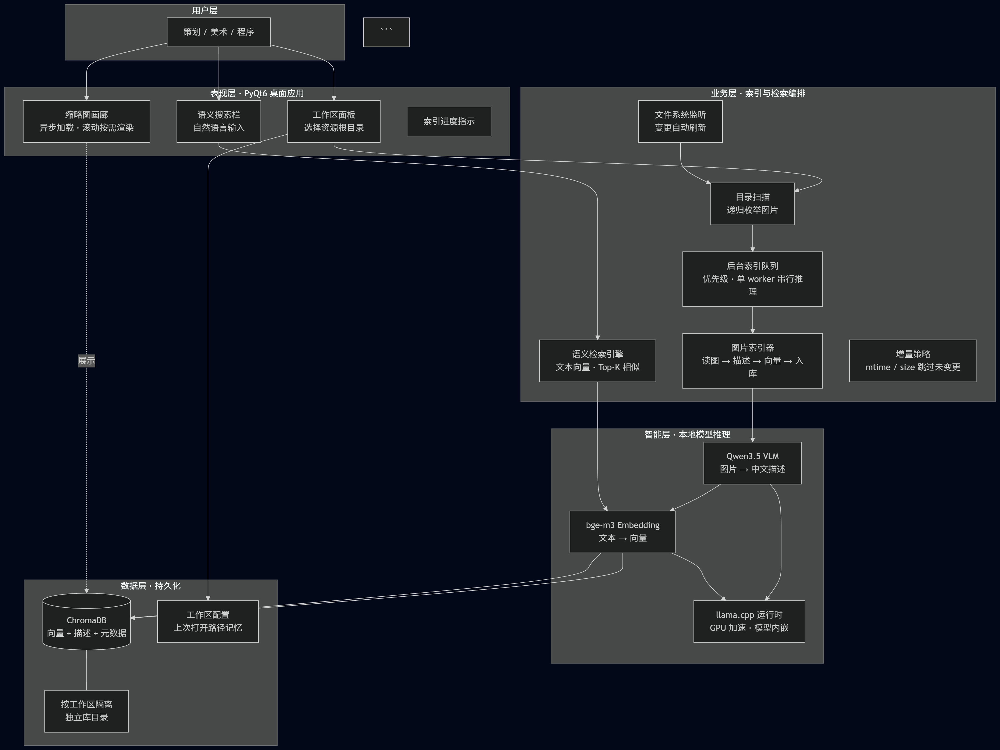
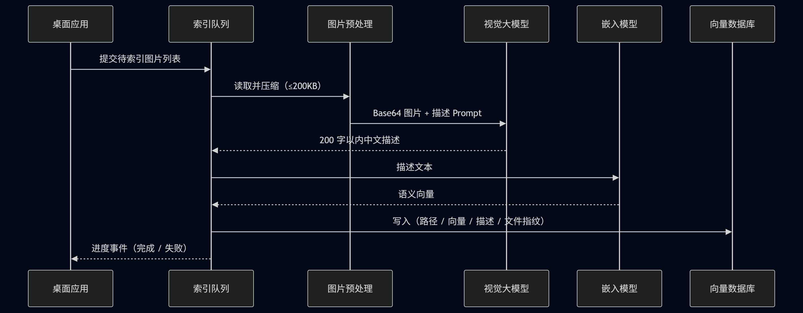
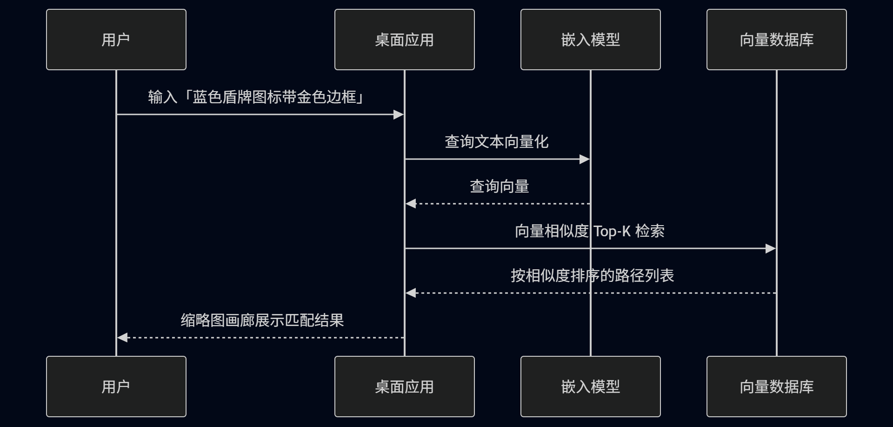

## 一、项目背景与动机

### 1.1 为什么要做

这个项目是我为了解决工作中的一个痛点，就是当资源图片非常多的时候，想要根据对这张图片的印象找到具体在哪变得几乎不可能。

我观察到：人找图时的自然习惯，并不是记文件名或路径，而是**用眼睛看、用语言描述**——「一个红色圆形关闭按钮，带白色叉号」。传统文件名搜索、哈希比对，都无法很好匹配这种思维方式。

### 1.2 核心洞察

若能把「图片长什么样」转化为**可检索的语义表示**，再在大规模图库中做相似度匹配，就能让检索方式与人的认知习惯对齐。

由此形成两条互补路径：

| 方向 | 思路 | 类比 |
|------|------|------|
| **正向（建库）** | 批量读取图库 → 生成自然语言描述 → 描述转向量 → 存入向量库 | 给每张图写「身份证」 |
| **逆向（检索）** | 用户输入描述 → 同样转向量 → 在向量库中找最近邻 | 凭「长相描述」找人 |

这一思路与当前多模态大模型（VLM）、文本嵌入（Embedding）、向量数据库（Vector DB）的技术成熟度高度契合，具备落地条件。

---

## 二、解决方案概览

### 2.1 产品目标

打造一款**开箱即用、纯本地运行**的桌面应用，服务对象包括不熟悉命令行与复杂配置的策划、美术等非技术人员。核心能力：

1. **选择工作区**：指向游戏资源根目录，自动扫描全部图片；
2. **后台语义建库**：静默为每张图生成描述与向量，进度可感知；
3. **自然语言搜图**：输入中文描述，按语义相似度排序展示结果；
4. **增量更新**：文件变更后自动感知，仅重建有变化的索引。

## 三、模块职责划分

### 3.1 模块划分

**界面部分使用了开源库https://github.com/Wanderson-Magalhaes/PyOneDark_Qt_Widgets_Modern_GUI**

| 层次 | 模块 | 职责 |
|------|------|------|
| 入口 | `vl_gui.py` | 主窗口、工作区加载、搜索交互、索引进度轮询 |
| 界面 | `gui/` | 主题、侧栏、标题栏搜索框、缩略图列表组件 |
| 索引 | `vl_indexer.py` | 单张图片完整建库流水线 |
| 任务 | `vl_tasks.py` | 后台优先级队列，避免阻塞 UI |
| 图片 | `vl_image_util.py` | 递归扫描、EXIF 校正、JPEG 压缩、Base64 编码 |
| 推理 | `vl_llama_local.py` | VLM 描述 + Embedding，兼容打包路径 |
| 数据 | `vl_db.py` / `vl_workspace_db.py` | ChromaDB 封装；按工作区根目录哈希分库 |
| 配置 | `gallery_folders_config.py` | 记住上次打开的资源目录 |
| 打包 | `vl_gui.spec` | PyInstaller 一键目录分发 |

### 3.2 功能流程图

## 五，如何打包

本项目是支持直接打包成一个本地推理服务。需要用到PyInstaller

需要用到的模型（需要到Huggingface自行下载，并放到model目录下）：
bge-m3-Q2_K.gguf
mmproj-F16.gguf
Qwen3.5-2B-Q8_0.gguf